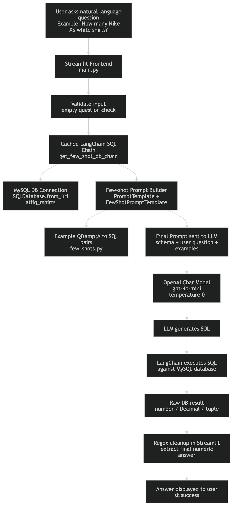
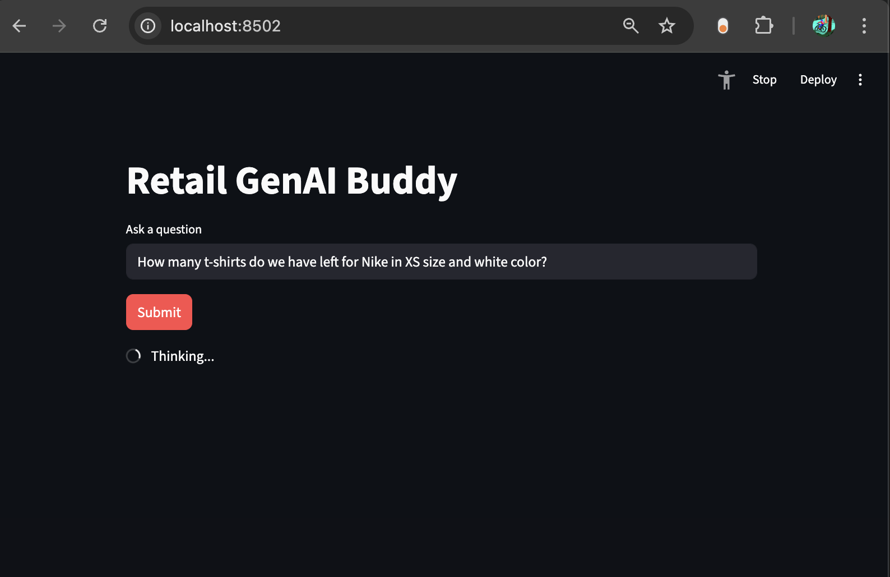
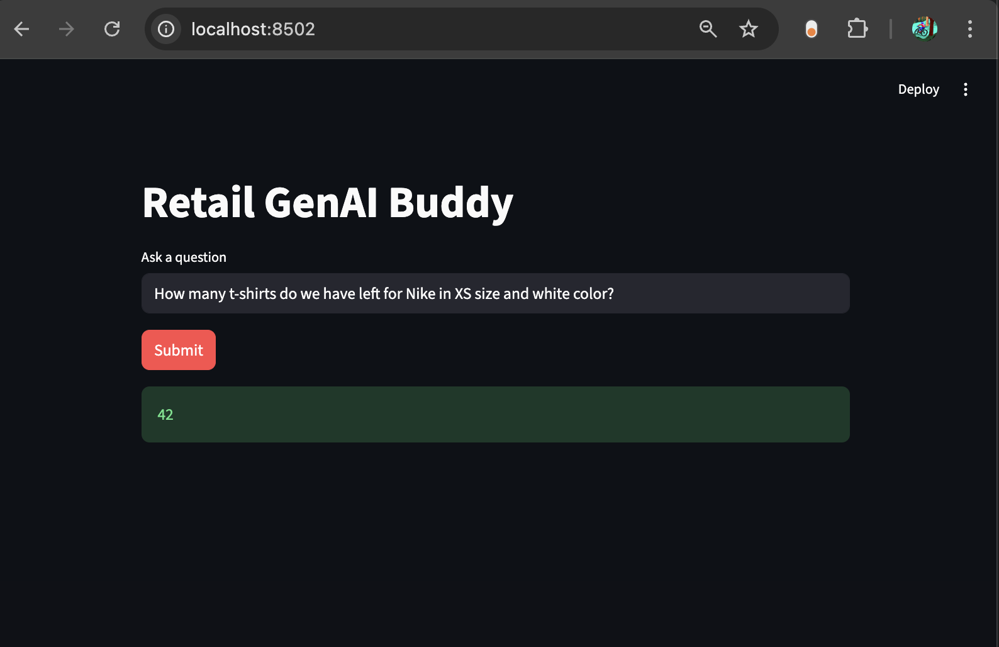

# Retail GenAI LLM

A GenAI LLM project for querying a retail t-shirt inventory database using LangChain, OpenAI, and MySQL.

## Features

- Natural language to SQL query flow
- Few-shot prompting support
- Streamlit frontend for asking questions

## Project Structure

- `frontend/` - Streamlit app and helper modules
- `langchain-db/` - Notebook experiments and SQL chain setup
- `gpt_client.py` - Shared OpenAI/LangChain client setup
- `database/` - SQL schema script

## Setup

1. Create and activate a virtual environment.
2. Install dependencies:
   - `pip install -r requirements.txt`
3. Add your API key in `.env`:
   - `OPENAI_API_KEY=...`

## Database Setup

This project includes a dummy MySQL dataset for local testing:

- Script path: `database/db_creation_atliq_t_shirts.sql`
- Database name used by the app: `atliq_tshirts`

Load it into MySQL:

- `mysql -u root -p < database/db_creation_atliq_t_shirts.sql`

If needed, update DB credentials in `frontend/main.py` to match your local MySQL setup.

## Run

- Start frontend app:
  - `streamlit run frontend/main.py`

## Flowchart

## Photos

## Sample Questions

Try these in the Streamlit app:

- How many t-shirts do we have left for Nike in XS size and white color?
- How many white color Levi's shirts do we have available?
- How much is the total inventory value for all S-size t-shirts?
